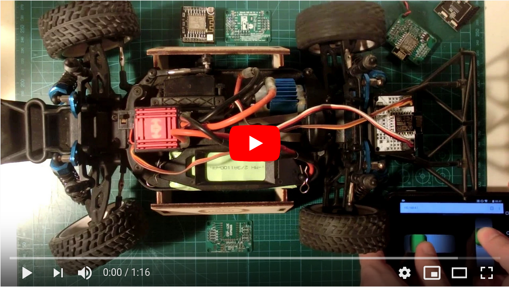
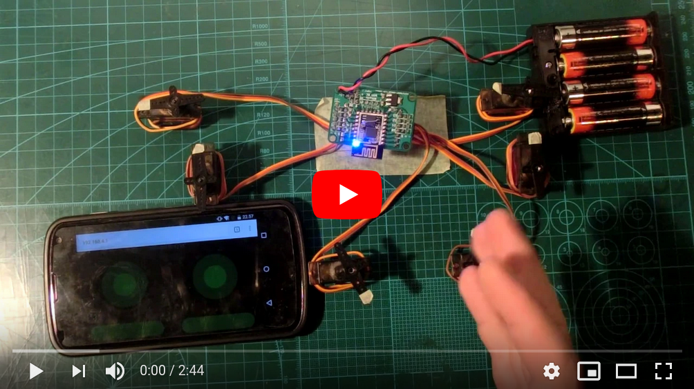
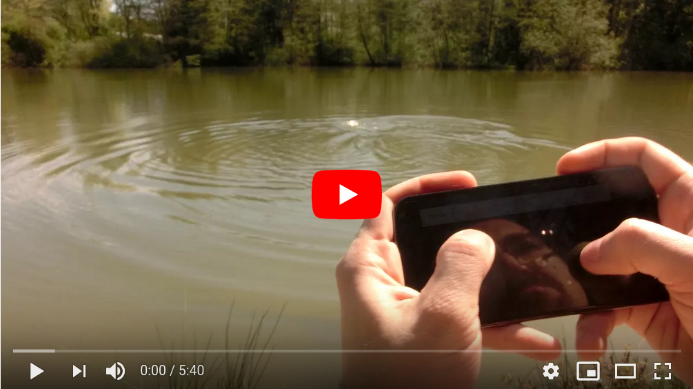
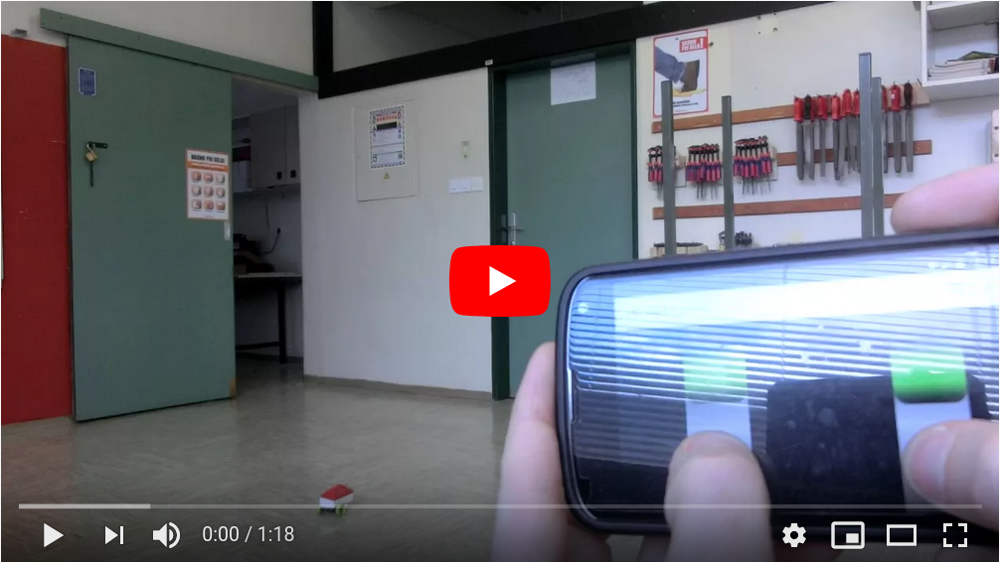
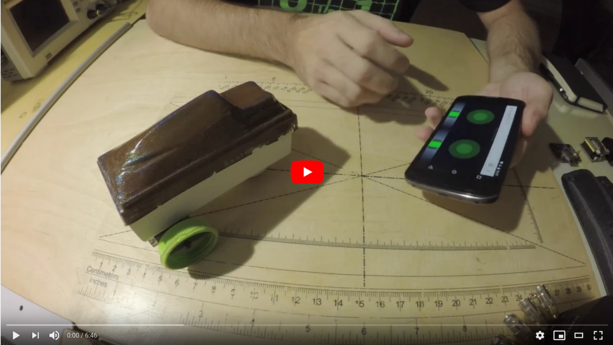

# Miharix WiFi RC
[SLO](#slo) / [DE](#de) / [ENG](#eng)

PCB and Firmware for **super cheap RC control over WiFi (Smart phone, Tablet, PC, ...)**

 I was a teacher(10 years) and wanted to make RC more affordable and be able to build something RC in class
 (yes all kids in a regular class and for grade - budget: 15€/kid)

So I made a this simple and very cheap module that enables to control standard RC components using WiFi and Phone/Tablet/PC
BUT the main difference to existing one is,
**IT DOESN'T NEED a special software**, only a web-browser and it **DOESN'T need an internet connection**.
*(you don't want to install something to 100 kids phones, and not all phones are the same! paid data traffic no go!)
And to reprogram it(new sw version / first steps to robotics) you need an inexpensive WittyCloud(~2€).*

The module was used in my class, 3 other teachers, and in 2 modellmaking summer camps. Totally around 300 kids*

Published in [11/2018](https://www.elektormagazine.com/index.php/magazine/elektor-52/42095)  on page 82

Published in magazine [TIM 4/2018](https://plus.si.cobiss.net/opac7/bib/40185093)  on page 24-27

 

* ***I stil have some asembled & programmed modules and also bare PCB-s left.
If you are interested, let me know [m.....x@gmail.com](https://mailhide.io/e/yFDyB)***

---

#### [ENG]

PCB and Example Software for making super cheap RC control over WiFi (mobile phone,tablet,...)

If you like this project, you are welcome to support this and my further projects over https://paypal.me/miharix

What is in the folders:

* **3Dp** - simple 3Dp case
* **Arduino** - *source code examples for programming the module*
* **DIY** - *pdf for making PCB DIY at home*
* **Documentation** - *shematic and dimensions*
* **Gerber** - *files for a PCB factory*
* **Render** - *3D render of PCB*
* **Python** - *source code examples for PC control*

**For building you also need:**

* 1x ESP-12E *(ESP8266)*
* 1x MCP1755ST-3302E 3,3V 300mA
* 2x 10K SMD805 (10 kilo ohm)
* 2x 1µF SMD805 (1 mikro Farad)
* optional 3-44 pin header male one line breakable raster 2,54mm

For easy programming use "Witty cloud"

Ground range test cca 90m
[(5s before car stops, the signal is lost)](https://youtu.be/WoqIe_oOWTM)

Todo List:

* Testing on more devices
* Range test using external antena, router...
* Manual(video?) how to build, programming, configure...
* ~~(6 servo demo)Expo~~
* (6 servo demo)Disable nipple retun to center for individual axes 
* (6 servo demo)Simultan button(channel 5&6) press and nipple usage
* ...

---

#### [DE]

Schaltung und  Programmierbeispiele um eine super-billige Modellbaufernbedienung über WiFi (Smartphone, Tablett,...) zu bauen.

Wen ihnen die Schaltung nutzbar ist, können Sie die Weiterentwicklung diesen und zukünftige Projekte mit kleiner Donation über https://paypal.me/miharix unterstützen.

Was sich in der Unterordner befindet:

* **3Dp** - einfaches 3Dp Gehäuse
* **Arduino** - *Programmierbeispiele um den Modul zu programmieren*
* **DIY** - *pdf um die Schaltung Zuhause selber nachzumachen*
* **Documentation** - *Schema der Schaltung und Maßnahmen*
* **Gerber** - *Dateien für PCB Hersteller*
* **Render** - *3D Rander von PCB*
* **Python** - *Programmierbeispiele um Mudil mit PC zu steuern*

**Um es zu bauen braucht man noch:**

* 1x ESP-12E *(ESP8266)*
* 1x MCP1755ST-3302E 3,3V 300mA
* 2x 10K SMD805 (10 kilo ohm)
* 2x 1µF SMD805 (1 mikro Farad)
* Optional 3-44 Stiftleisten Raster 2,54mm

Um es es ganz einfach zu Programmieren ist die "Witty cloud" als Programmierer gerät vorgesehen. 

Getestete Reichweite am Boden hohe cca 80m
 [(5s bevor der Auto anhielt wurde der Signal abgebrochen)](https://youtu.be/WoqIe_oOWTM)

Noch zu tun:

* Test auf Kompatibilität mit noch mehreren Geraten
* Test der Reichweite bei Gebrauch einer externer Antenne, Routers...
* Anleitung(Video?) wie man es baut, programmiert, konfiguriert...
* ~~(6 servo demo)Expo~~
* (6 servo demo)Ausschalten in die Mitte zurück springen beliebiges Knüppel  
* (6 servo demo)Gleichzeitige Aktivierung der Knöpfe 5&6 und Knüppel Bewegung.
* ...

---

#### [SLO]

Vezje in programski primeri za izdelavo super poceni RV preko WiFi (pametni telefon,tablica,...)

V kolikor vam vezje koristi, lahko podprete razvoj tega ter bodočih projektov s donacijo preko: https://paypal.me/miharix

Kaj se nahaja v mapah:

* **3Dp** - preprosto ohišje za 3Dp
* **Arduino** - *programski primeri za programiranje modula*
* **DIY** - *pdf za izdelavo tiskanega vezja v domači delavnici*
* **Documentation** - *shema vezave in mere*
* **Gerber** - *datoteke za proizvajalca vezij*
* **Render** - *3D izris vezja*
* **Python** - *primer kode za krmiljenje iz računalnika*

**Za  izdelavo še potrebujete:**

* 1x ESP-12E *(ESP8266)*
* 1x MCP1755ST-3302E 3,3V 300mA
* 2x 10K SMD805 (10 kilo ohm)
* 2x 1µF SMD805 (1 mikro Farad)
* opcijsko 3-44 letev moška enoredna lomljiva raster 2,54mm

Za preprosto programiranje predvidena uporaba "Witty cloud"

Testiran domet na zemlji približno 80m
 [(5s preden se avto ustavi na tem posnetku, se je zgubil signal)](https://youtu.be/WoqIe_oOWTM)

Za naredit:

* Testirat na čim več napravah
* Test dometa pri uporabi zunanje antene, ruterja...
* Navodila(video?) kako izdelat, programirat, nastavljat...
* ~~(6 servo demo)Expo~~
* (6 servo demo)Izklop samodejnega povratka ročice poljubne osi v središče
* (6 servo demo)Sočasno aktivianje gumba za 5&6 med premikanjem ročic
* ...

---
